<div align="center">

# Solo Leveling Workout App: The System, for Real Training

**A free, offline workout tracker inspired by *Solo Leveling*.**
Take the Daily Quest, clear Gates, extract shadows from your real PRs and rise from E-Rank to S-Rank.
The numbers behind it come from actual progressive overload.

### [▶ Open the app — free, no sign-up](https://solo-leveling.tanujpatra228.workers.dev/)


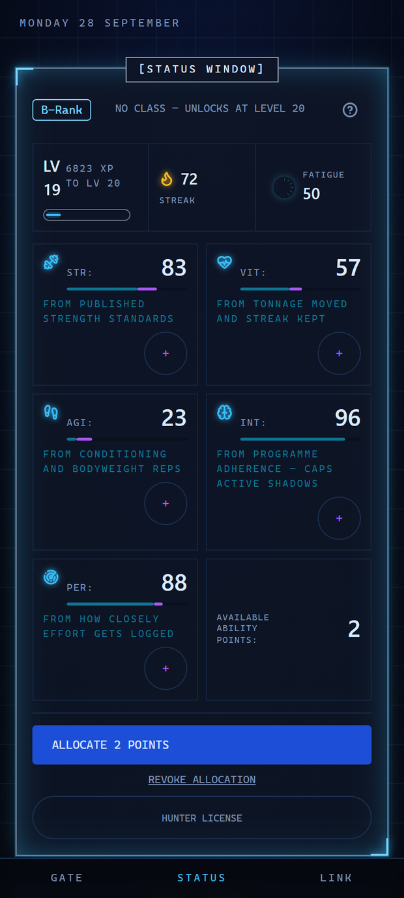

</div>

---

> *[You have obtained the qualification to enter the Double Dungeon.]*

In *Solo Leveling*, Sung Jinwoo becomes the only Player of a System that turns training into levels. This app is that System, built for your own workouts. Log your sets at the gym or at home, and the System turns them into **XP, levels, stats, ranks and a Shadow Army**.

This is not a checklist that pays out for tapping "done". Every number is calculated from what you lifted:

- **Your rank is measured against published strength standards.** You can't grind it.
- **A shadow is extracted only when a lift crosses into a new strength tier.** Gold can't buy one.
- **Next session's weights come from a double-progression engine.** It tells you exactly why the load went up.

It is free, needs no account, and runs entirely on your phone, including in airplane mode.

<p align="center">
  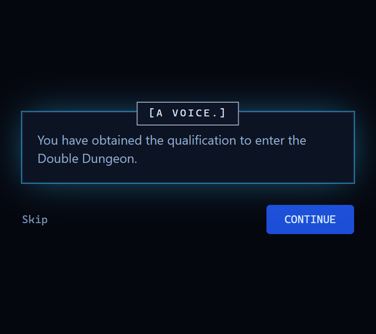
</p>

## Contents

- [Why hunters use it](#why-hunters-use-it)
- [Features](#features)
- [Start in 60 seconds](#start-in-60-seconds)
- [FAQ](#faq)
- [For developers](#for-developers)

## Why hunters use it

| | |
|---|---|
| 🎮 **The whole System** | Daily Quest, Penalty Quest, Gates, Red Gates, Dungeon Breaks, Shadow Army, Demon Castle, Runes, Titles, System Shop, Hunter License, Job Change. |
| 🏋️ **Real training underneath** | Progressive overload, estimated 1RM, weekly volume per muscle, fatigue (ACWR) and deload prompts. |
| 🏠 **Gym or home** | Choose your equipment once. With bodyweight only, you get a full bodyweight program. |
| 📴 **Offline first** | Your log lives on your phone. Nothing waits on the network, and logging a set never shows a spinner. |
| 🔒 **No account** | No email, no password, no ads, no paywall. Sync between devices is optional and uses a key you hold. |
| 📖 **Coaching built in** | 72 exercise guides with setup, steps, common mistakes and a muscle map. |

## Features

### Daily Quest: the Solo Leveling workout, scaled to you

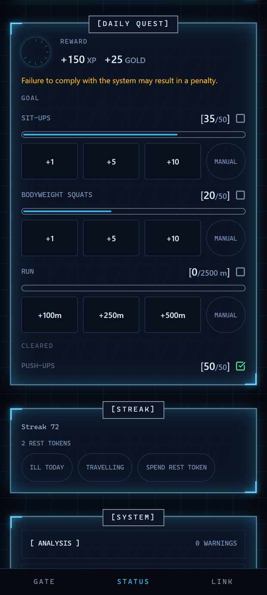

**[Daily Quest has arrived.]** Push-ups, sit-ups, bodyweight squats and a run, straight from the anime.

Jinwoo's 100 / 100 / 100 / 10 km is a fantasy on day one. Here the quest **starts at 20% of the canon targets and grows with your level, reaching the full 100 reps at level 50.** The run is capped at 2.5 km, so the quest stays a daily habit rather than a second workout.

- Clearing it pays **+150 XP and +25 gold** and keeps your streak alive.
- Miss a day and a **Penalty Quest** carries the unfinished work forward with a 50% surcharge. *Failure to comply with the system may result in a penalty.*
- The Penalty Quest never takes away your level, stats or logged work. It only adds to what you owe.
- You get **2 rest tokens a month**. You can declare *Ill today* or *Travelling*, and a forgiven day doesn't break the streak.

<br clear="right">

### Gates: every workout is a dungeon

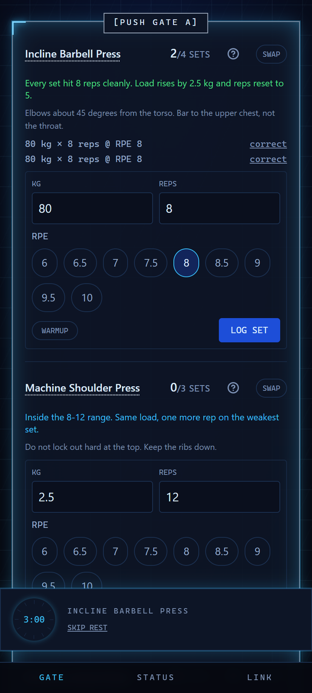

Each training day opens a **Gate** ranked E to S by the work it holds. The gym program is a **Push / Pull / Legs** split, and there is a full bodyweight program for training at home.

- **Log sets in seconds.** Weight, reps and RPE are pre-filled with today's target, so most sets are two taps.
- **The progression engine explains itself**, for example: *"Every set hit 8 reps cleanly. Load rises by 2.5 kg and reps reset to 5."*
- **The rest timer** counts down in a dock that stays put when you change screens, and chimes when the rest is over. The screen stays awake during a session.
- **A PR on your top set slays the Boss.** *[Boss slain.]*
- **Swap an exercise** when the machine is taken. The System ranks substitutes that work the same muscles.
- **Red Gates** unlock at B-Rank: a one-rep PR attempt or an AMRAP finisher, with no partial credit.
- **Instant Dungeon Key** builds a five-exercise session from whatever equipment is in front of you.
- If a Gate stays open for a week, it breaks. That's a **Dungeon Break**, and it comes with a backlog surcharge.

<br clear="right">

<p align="center">
  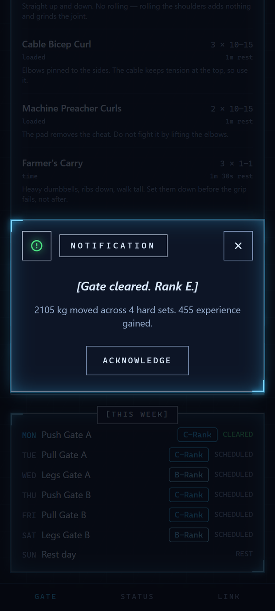
</p>

### Shadow Army: ARISE

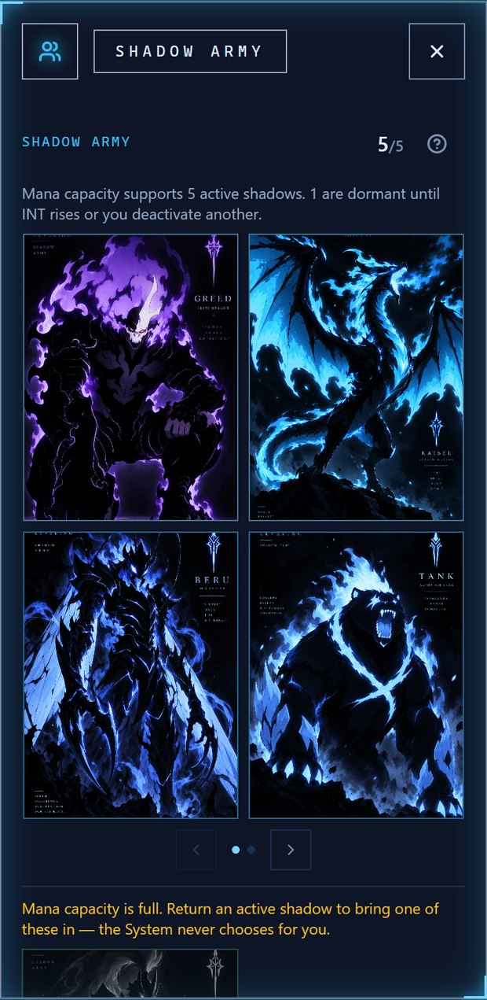

**ARISE.** When one of your lifts crosses into a new strength tier for the first time, the System extracts a shadow from it: **Igris, Beru, Tank, Greed, Kaisel** and more, named and ranked by how strong that lift is.

- Every shadow gives a passive buff: bonus XP, shorter rest, more recoverable volume, or, for an S-Rank shadow, a shield for your streak.
- Your **strongest lifts become Marshals**.
- **INT sets your mana capacity**, which is how many shadows can be active at once. Choosing who to summon is a real decision, and *the System never chooses for you*.

A shadow is proof of a PR. You can't buy one or grind for it.

<br clear="right">

### Level up: stats, ranks and your Hunter License

The **Status Window** shows your level, XP, streak, fatigue and five stats. Each stat is half earned from your last 28 days of training and half assigned by you, with 3 ability points per level:

| Stat | Earned from |
|---|---|
| **STR** | Your lifts against published strength standards |
| **VIT** | Tonnage moved and streak kept |
| **AGI** | Conditioning and bodyweight reps |
| **INT** | Sticking to the program. It also sets how many shadows you can keep active |
| **PER** | How closely you log your effort (RPE) |

**Hunter rank goes from E to S** and is calculated from your major lifts against real strength tables. **About a year of consistent training reaches level 50.** At level 20 the **Job Change Quest** assigns your class, *Fighter, Tanker, Assassin or Ranger*, based on the stats you have built.

<p align="center">
  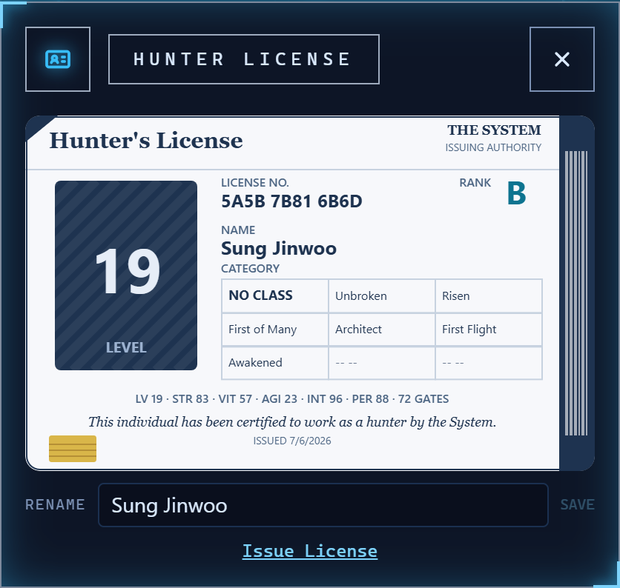
</p>

Your **Hunter License** is a shareable ID card with your rank, level, titles and stats. Rename your hunter and share it as an image.

### Demon Castle, Runes, Titles and the System Shop

<table>
<tr>
<td width="50%" valign="top">

**🏰 Demon Castle**: 100 floors of lifelong goals, such as bodyweight ratios, rep targets, streaks and lifetime tonnage. Floors clear themselves as you reach them, and a Monarch boss waits on every tenth floor, from **Cerberus** on floor 10 to **Baran, Monarch of White Flames** on floor 100.

**📜 Titles**: 21 titles, each earned for something you actually did. *Wolf Assassin* takes 100 push-ups in one set, *Monarch of Iron* a squat at 2× bodyweight, and *Unbroken* a 30-day streak. *Shadow Monarch* is waiting at the top of the castle.

</td>
<td width="50%" valign="top">

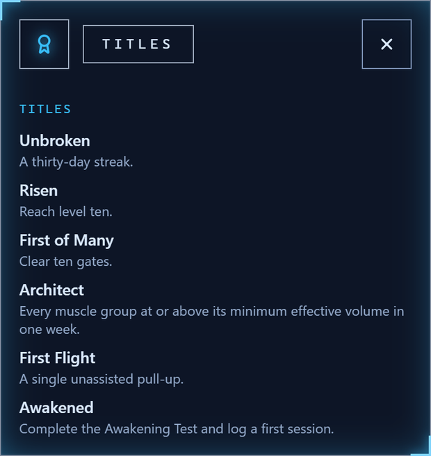

</td>
</tr>
<tr>
<td width="50%" valign="top">

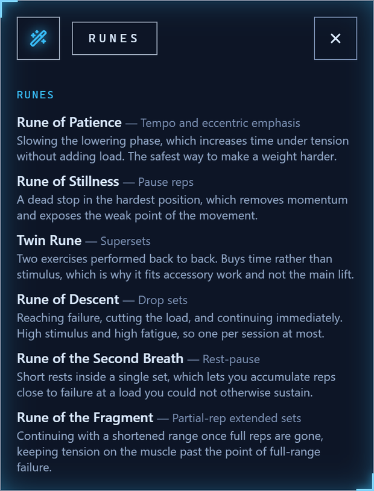

</td>
<td width="50%" valign="top">

**🔮 Runes**: 11 real intensity techniques that unlock as you level up: tempo, pauses, supersets, drop sets, rest-pause, clusters and AMRAP. Each one tells you when it's worth using.

**🪙 System Shop**: gold comes only from Gates and Daily Quests. It buys rest tokens and quest rerolls, and never anything your training should earn.

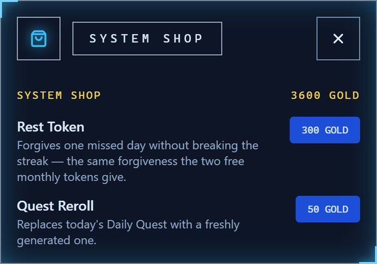

</td>
</tr>
</table>

### Analysis: a coach in the System

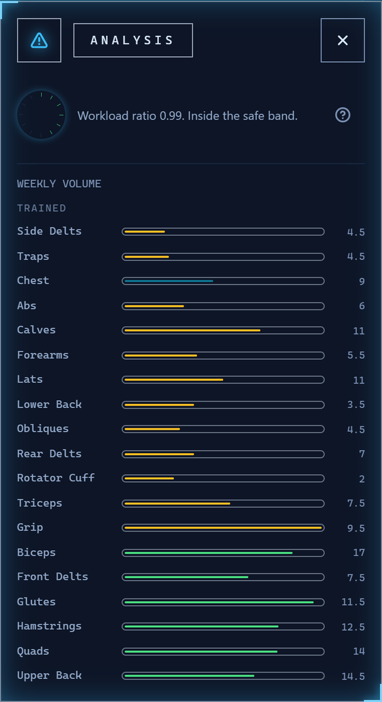

- **Weekly volume per muscle** against evidence-based landmarks (MEV / MAV / MRV), so you can see what is undertrained.
- **Fatigue tracking** uses the acute:chronic workload ratio. When you push too hard, XP is scaled down and a **Recovery Quest** takes the place of lifting.
- **Deload prompts** come every fifth week, after a workload spike, or when performance slips.
- **Program warnings** flag gaps, such as no hip hinge this week, no rotator-cuff work or no single-leg training.
- The **Reawakening Test** re-measures bodyweight and waist every 8 to 12 weeks.

<br clear="right">

### Exercise guides with muscle maps

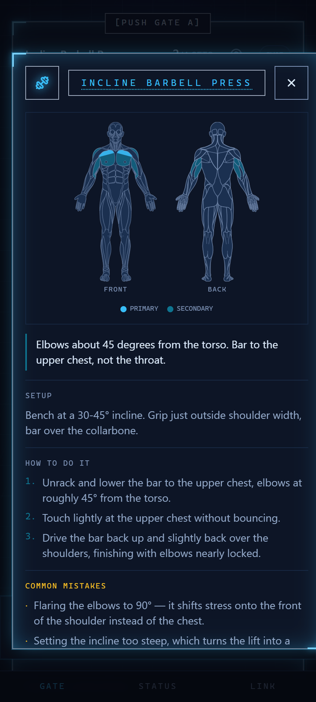

Tap **?** on any exercise to see its setup, step-by-step form, common mistakes and a front and back **muscle map**, with primary and secondary muscles highlighted. There is also a one-tap video search. The library has 81 exercises, from barbell squats and Romanian deadlifts to archer push-ups, pistol squats, Nordic curls and wall handstand push-ups.

<br clear="right">

### Built to be carried everywhere

- **Install it like an app** from your browser: Android, iPhone (Share → Add to Home Screen) or desktop.
- **Fully offline.** It works in a basement gym with no signal.
- **Private by design.** No login. Your training history stays on your device.
- **Optional sync.** Turn on the mirror and pair a second device by scanning your Hunter License Key as a QR code.
- Metric or imperial units, tap sounds and haptics. The training day rolls over at 04:00, so a late-night session still counts for the day you trained.

## Start in 60 seconds

1. **[Open the app](https://solo-leveling.tanujpatra228.workers.dev/)** on your phone.
2. Enter the **Double Dungeon**, then take the **Awakening Test**: your hunter name, body measurements, training history and the equipment you have.
3. Your first Gate and Daily Quest are waiting. Add the app to your home screen and start leveling.

<div align="center">

### [▶ Arise — open the app](https://solo-leveling.tanujpatra228.workers.dev/)

</div>

## FAQ

<details>
<summary><b>Is there a real Solo Leveling workout app?</b></summary>

Yes, this is one. It's a free web app that recreates the System from *Solo Leveling*: the Daily Quest, Gates, the Shadow Army, E-to-S hunter ranks, and levels and stats. It is built on a real strength-training program rather than a fixed checklist. Open it in any browser and install it to your home screen.
</details>

<details>
<summary><b>What is the Solo Leveling daily quest workout?</b></summary>

In the story, the System orders Sung Jinwoo to do **100 push-ups, 100 sit-ups, 100 squats and a 10 km run** every day. In this app the Daily Quest uses the same exercises, starts at 20% of those targets and grows with your level until you reach the full 100 reps at level 50. The run is capped at 2.5 km.
</details>

<details>
<summary><b>Can a beginner do it?</b></summary>

Yes. The Awakening Test asks about your training history and equipment. The Daily Quest scales to your level, and the progression engine only adds load after you've earned it. Beginners start at E-Rank, as Jinwoo did.
</details>

<details>
<summary><b>Do I need a gym?</b></summary>

No. Choose "Bodyweight" in the Awakening Test and you get a full bodyweight program: push, pull, legs, core and conditioning Gates. With a pull-up bar, bands or dumbbells, the System adds those in.
</details>

<details>
<summary><b>Is it free? Do I need an account?</b></summary>

It's free, with no account, no ads and no in-app purchases. The in-game gold is earned by training and spent only in the System Shop.
</details>

<details>
<summary><b>Does it work offline or on iPhone?</b></summary>

Yes to both. It's a Progressive Web App: everything is stored on your device and works without a connection. On Android, tap *Install*. On iPhone, open it in Safari and choose Share → Add to Home Screen.
</details>

<details>
<summary><b>What happens to my data?</b></summary>

It stays on your phone. Syncing is off by default. If you turn it on, a copy of your training log is mirrored to the server under a random Hunter License Key. There is no email or password, and *Forget the mirror* deletes the server copy whenever you like.
</details>

## For developers

This is a React 19 + TypeScript PWA. IndexedDB (Dexie) is the source of truth, and a single Cloudflare Worker with D1 serves as an optional sync mirror. All game state is derived from an append-only training log.

```bash
pnpm install   # needs pnpm 10.34.5 (see packageManager)
pnpm dev       # http://localhost:5173
pnpm test && pnpm run typecheck
```

Architecture, constraints and working rules are in [`CLAUDE.md`](CLAUDE.md), [`docs/engineering-standards.md`](docs/engineering-standards.md) and [`docs/infrastructure.md`](docs/infrastructure.md).

If you like the app, a ⭐ helps other hunters find it.

---

<sub>*Solo Leveling Workout App* is an unofficial, non-commercial fan project. It is not affiliated with, endorsed by or connected to the creators, publishers or licensors of *Solo Leveling*. All character names are used for fan tribute only. This app is not medical advice. Train within your limits.</sub>
